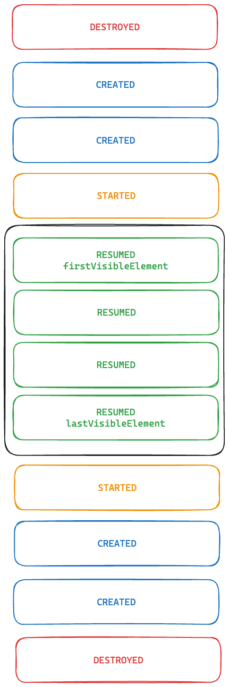

## Decompose LazyList

Using [Decompose](https://github.com/arkivanov/Decompose) with compose LazyList

Visual logic of the list item lifecycle

The index of the element between the first visible element inclusive and the last visible element inclusive is `Status.RESUMED`, the element before
the first visible and after the last visible is `Status.STARTED`, and the rest are `Status.CREATED`

